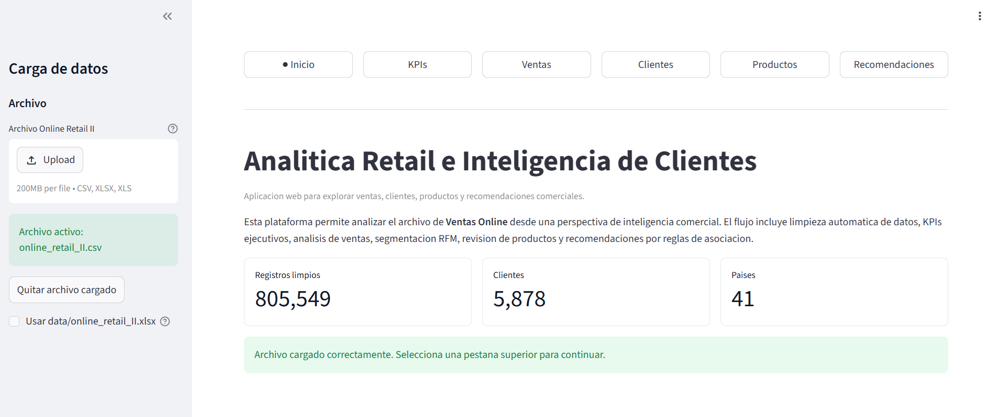
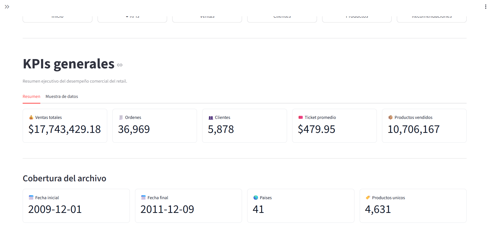
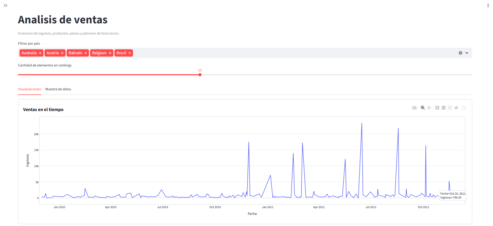
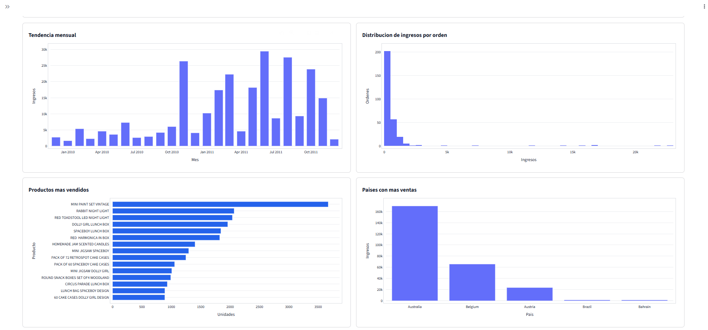
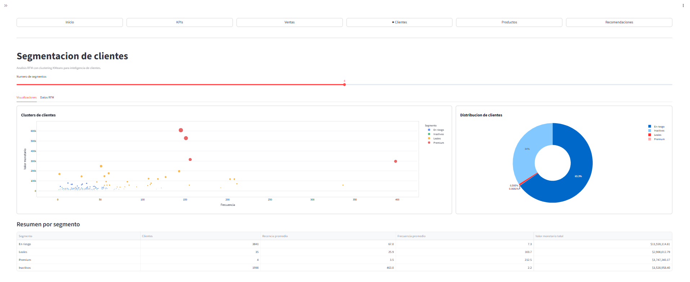
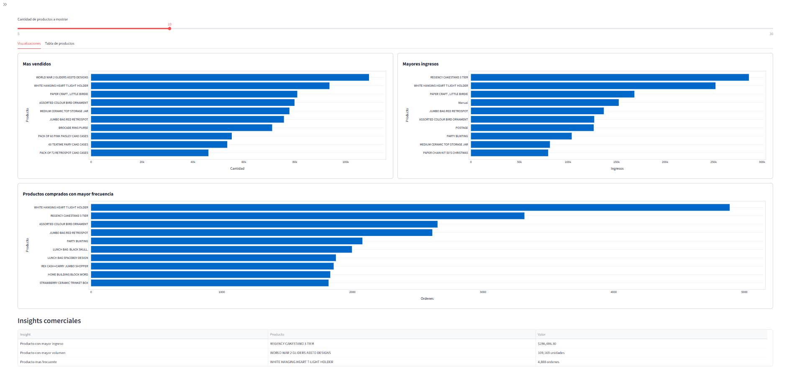
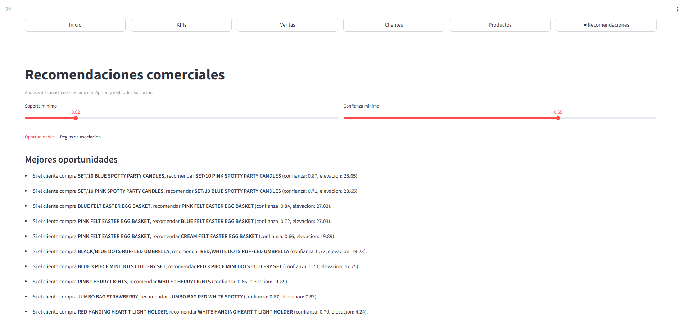

# 🛒 Analítica Retail y Recomendaciones Comerciales

Aplicación web multipágina desarrollada con **Streamlit** para análisis de ventas, segmentación de clientes y recomendaciones comerciales utilizando el dataset **Online Retail II UCI**.

---

## 🚀 Demo

🔗 **Aplicación desplegada en Streamlit Cloud**  
[https://proyectoucg-cgalabay.streamlit.app](https://proyectoucg-cgalabay.streamlit.app/)

🔗 **Repositorio del proyecto**  
[https://github.com/CarlosGalabay7/Proyecto_UCG](https://github.com/CarlosGalabay7/Proyecto_UCG)

---

## 📸 Capturas de la aplicación

### 🏠 Página de inicio


### 📊 KPIs generales


### 📈 Análisis de ventas



### 👥 Segmentación de clientes


### 🛍️ Análisis de productos


### 🤝 Recomendaciones comerciales


---

# 📌 Descripción del proyecto

La aplicación permite cargar datasets de retail desde la interfaz web y realizar un análisis integral orientado a inteligencia comercial y customer analytics.

El flujo incluye:

- Carga dinámica de archivos.
- Limpieza automática de datos.
- KPIs ejecutivos.
- Análisis exploratorio de ventas.
- Segmentación de clientes mediante RFM y KMeans.
- Análisis de productos.
- Recomendaciones comerciales mediante reglas de asociación.

---

# 🎯 Objetivos

## Objetivo general

Desarrollar una aplicación web interactiva utilizando Streamlit para el análisis inteligente de datos retail y generación de insights comerciales.

## Objetivos específicos

- Implementar carga y validación de datasets.
- Automatizar procesos de limpieza de datos.
- Construir dashboards interactivos.
- Aplicar segmentación de clientes mediante RFM y KMeans.
- Implementar análisis de canasta de mercado con Apriori.
- Generar recomendaciones comerciales basadas en reglas de asociación.

---

# 📦 Dataset utilizado

**Dataset:** Online Retail II UCI

📚 Fuente oficial:
https://www.kaggle.com/datasets/mashlyn/online-retail-ii-uci

El dataset contiene información transaccional de un negocio retail online, incluyendo:

- Facturas
- Productos
- Clientes
- Cantidades
- Fechas
- Países
- Precios

---

# ⚙️ Tecnologías utilizadas

## Lenguaje y framework

- Python 3
- Streamlit

## Procesamiento y análisis de datos

- Pandas
- NumPy

## Visualización

- Plotly

## Machine Learning

- Scikit-learn
- KMeans Clustering

## Market Basket Analysis

- Mlxtend
- Apriori
- Association Rules

---

# 🏗️ Arquitectura del proyecto

```text
PROYECTO_UCG/
│
├── app.py
├── requirements.txt
├── README.md
│
├── pages/
│   ├── 1_KPIs.py
│   ├── 2_Sales_Analysis.py
│   ├── 3_Customer_Segmentation.py
│   ├── 4_Product_Insights.py
│   └── 5_Recommendations.py
│
├── utils/
│   ├── charts.py
│   ├── data_loader.py
│   ├── market_basket.py
│   ├── metrics.py
│   ├── preprocessing.py
│   ├── segmentation.py
│   └── ui.py
│
├── assets/
├── models/
├── data/
└── .streamlit/
```

---

# ✨ Funcionalidades principales

## 📊 KPIs ejecutivos

La aplicación calcula automáticamente:

- Ventas totales
- Número de órdenes
- Clientes únicos
- Ticket promedio
- Productos vendidos
- Cobertura temporal del dataset

---

## 📈 Análisis de ventas

Visualizaciones interactivas para:

- Evolución de ingresos en el tiempo
- Tendencias mensuales
- Distribución de ingresos
- Países con mayores ventas
- Productos más vendidos

---

## 👥 Segmentación de clientes

Implementación de análisis RFM:

- Recency
- Frequency
- Monetary

Posteriormente se aplica:

- KMeans Clustering

Segmentos generados:

- Premium
- Leales
- En riesgo
- Inactivos

---

## 🛍️ Análisis de productos

La plataforma permite identificar:

- Productos con mayor volumen
- Productos con mayores ingresos
- Productos más frecuentes
- Insights comerciales relevantes

---

## 🤝 Recomendaciones comerciales

Se implementó análisis de canasta de mercado mediante:

- Algoritmo Apriori
- Reglas de asociación

Métricas utilizadas:

- Support
- Confidence
- Lift

Esto permite detectar oportunidades de:

- Cross-selling
- Recomendaciones
- Combos comerciales

---

# 🧹 Limpieza y transformación de datos

El flujo de limpieza incluye:

- Eliminación de clientes nulos.
- Eliminación de facturas canceladas.
- Eliminación de cantidades negativas.
- Eliminación de precios negativos.
- Conversión de fechas.
- Creación de la variable Revenue.

---

# 📂 Carga de archivos

La aplicación permite cargar archivos desde la interfaz web.

## Formatos soportados

- CSV
- XLSX
- XLS

## Columnas esperadas

- Invoice / InvoiceNo
- StockCode
- Description
- Quantity
- InvoiceDate
- Price / UnitPrice
- Customer ID / CustomerID
- Country

---

# ▶️ Instalación

## Clonar repositorio

```bash
git clone https://github.com/USUARIO/REPOSITORIO.git
```

## Instalar dependencias

```bash
pip install -r requirements.txt
```

---

# ▶️ Ejecución local

```bash
streamlit run app.py
```

Luego abrir:

```text
http://localhost:8501
```

---

# ☁️ Despliegue

La aplicación puede desplegarse fácilmente utilizando:

- Streamlit Cloud

Repositorio conectado directamente con GitHub.

---

# 📌 Resultados obtenidos

El proyecto permitió:

- Identificar segmentos de clientes relevantes.
- Detectar clientes en riesgo.
- Identificar productos líderes en ventas.
- Analizar tendencias comerciales.
- Generar recomendaciones comerciales mediante reglas de asociación.

---

# 📖 Conclusiones

La aplicación desarrollada demuestra cómo las herramientas de Ciencia de Datos y Machine Learning pueden integrarse en plataformas interactivas para generar inteligencia comercial en entornos retail.

El uso de técnicas como:

- KPIs analíticos,
- segmentación RFM,
- clustering KMeans,
- y Market Basket Analysis,

permitió transformar datos transaccionales en información útil para la toma de decisiones comerciales.

Además, Streamlit permitió desarrollar una solución visual, modular e interactiva orientada a analítica empresarial moderna.

---

# 📚 Referencias

- Kaggle. (2026). *Online Retail II UCI Dataset*. https://www.kaggle.com/datasets/mashlyn/online-retail-ii-uci

- Streamlit Documentation. https://docs.streamlit.io/

- Scikit-learn Documentation. https://scikit-learn.org/

- Mlxtend Documentation. http://rasbt.github.io/mlxtend/
